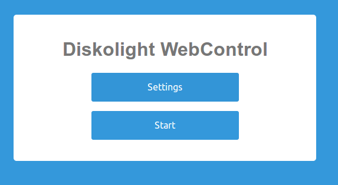
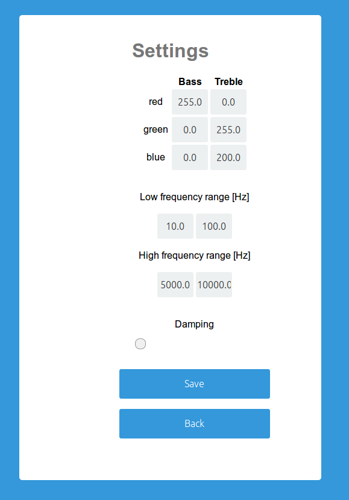

# Diskolight

Diskolight makes a LED-strip flash to your favorite music!
Demo video:

[](https://www.youtube.com/watch?v=i0-qI-DSFXs)

Control over the Diskolight is easily accessible through a webpage that is hosted by the raspberry pi.





## Hardware
 - raspberry pi 3
 - RGB LED strip
 - cheap soundcard
 - wires, MOSFETs, ...
 - aux cables
 - aux splitter

I followed [this tutorial](https://dordnung.de/raspberrypi-ledstrip/) by David Ordnung to connect the LED strip with the raspi.

The aux splitter is connected directly to the source of music. One aux cable is connected to the line-in channel of the raspi's sound card, the other one connects to the speakers.

## Software

#### TL;DR—Quickstart
Set up hardware and type this on your raspberry pi:

    ifconfig   # <--- write down ip-address
    git clone https://github.com/davekch/diskolight.git
    cd diskolight
    echo password > pwd.txt  # choose a password to access the control page
    pip3 install pyaudio numpy pigpio
    sudo apt-get install python3-flask
    sudo pigpiod
    sudo python3 webcontrol.py &

Connect your raspberry pi to a source of music. On any device that is in the same network as the raspi, open `http://<raspis-ip-address>`, log in with user `leddj` and your password.
Then press Start!

If something does not work right, here is a guide to test the different components of Diskolight and how to set up autostart.

### [ledstrip.py](ledstrip.py)
To access the GPIOs on the raspberry pi, you need `pigpiod` (usually preinstalled on raspbian). Make sure that the deamon is running: `sudo pigpiod`.

[ledstrip.py](ledstrip.py) requires the python module `pigpio` which is usually also preinstalled on raspbian.
Test out the LED-strip in an interactive python prompt:

```python
$ cd diskolight
$ python3
>>> import ledstrip
>>> led = ledstrip.LEDstrip()
>>>
>>> # make it glow green
>>> led.set_rgb(0,255,0)
>>> # yellow stroboscope
>>> led.rgb_strobo(255,255,0, flashes=50)
>>>
>>> led.stop()
```

### [diskolight.py](diskolight.py)
This module will listen to line-in, analyze the input and control the LED-strip. It requires `pyaudio` and `numpy`:
```
pip3 install pyaudio numpy
```
In order for pyaudio to work properly, you must first find out how it indexes the available input devices. You can do this interactively:
```python
$ python3
>>> import pyaudio
>>> p = pyaudio.PyAudio()
>>> p.get_default_input_device_info()
```
The output might look like this (beautified)
```python
{
    "defaultHighInputLatency": 0.034829931972789115,
    "defaultHighOutputLatency": 0.034829931972789115,
    "defaultLowInputLatency": 0.008684807256235827,
    "defaultLowOutputLatency": 0.008707482993197279,
    "defaultSampleRate": 44100.0,
    "hostApi": 0,
    "index": 2,  # <--- this is what we care about
    "maxInputChannels": 1,
    "maxOutputChannels": 2,
    "name": "USB Audio Device: - (hw:1,0)",
    "structVersion": 2
}
```
If the value of `index` is something different than 2, you need to go to [diskolight.py](diskolight.py), find the line that starts with `stream = p.open(` and change `input_device_index=2` to whatever your index is.

Now everything should be set up and you can try it out! Play some music to your raspberry's line-in and start the Diskolight:
```python
$ python3
>>> import diskolight
>>> disko = diskolight.Diskolight()
>>> disko.start()
# this method runs in its own thread so you can
# hit enter and continue to do stuff in the interpreter
>>> # change the color of the bass to red
>>> disko.set_bass_rgb(255,0,0)
>>> # stop it
>>> disko.stop()

close gracefully...
lights out...
>>>
```
If you find that the LED-strip is not precisely on the beat or randomly misses some loud beats you should fiddle around with the chunk size, eg: `disko = diskolight.Diskolight(chunk=2**12)` (use powers of two only).


### [webcontrol.py](webcontrol.py)
This script will host a small website in your local network that will allow you to start and control the Diskolight-module remotely.
It is powered by flask. Because you need to run it as root, you also have to install flask as root eg. `sudo pip3 install flask` or `sudo apt-get install python3-flask`.

The access to this site hides behind a login so that your roommates can't mess with your light :). The username is `leddj`. You can change this in the file  [webcontrol.py](webcontrol.py) inside the function `login()`. You also need to define a password which you must store in a file called `pwd.txt` inside the same folder as `webcontrol.py`:
```bash
echo yourpassword > pwd.txt
```

Finally, you need to find out your raspberry's ip-address and start the script like this:

```bash
sudo pigpiod  # if it's not already running
sudo python3 webcontrol.py -ip <ip-address>  # not yet implemented!!!
```
Open a browser on any machine that is connected to the same network and go to `http://<ip-address>`. Login, press Start, play some music, dance, be happy :)


### Set up autostart
So far, you need still need to log into your raspberry pi and start `webcontrol.py` manually.

If you're running raspbian, you can easily make the raspi start `webcontrol.py` automatically on boot by placing a file `diskolight.service` at `/lib/systemd/system/` with the following content:
```
[Unit]
Description=Diskolight Webcontrol
After=multi-user.target

[Service]
Type=idle
User=root
WorkingDirectory=/path/to/diskolight
ExecStart=/path/to/diskolight/start_webcontrol.sh &

[Install]
WantedBy=multi-user.target
```

Then do
```bash
sudo systemctl daemon-reload
sudo systemctl start diskolight.service
# check that it's active and running
systemctl status diskolight.service
```

The next time you want to use the Diskolight, all you have to do is start up the raspberry pi, plug in some music and start Diskolight via a web-browser.
